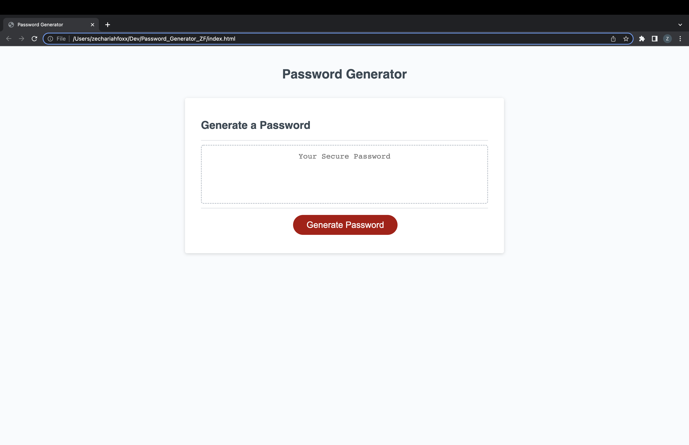

Created a series of prompts for password criteria

Created a prompt for the user to select the lenth of their password between 8-128 characters

Gave user the option to choose lowercase, uppercase, special charactors, and symbols for their password

Password was generated and displayed on the page 

https://zakfoxx.github.io/Password_Generator_ZF/

